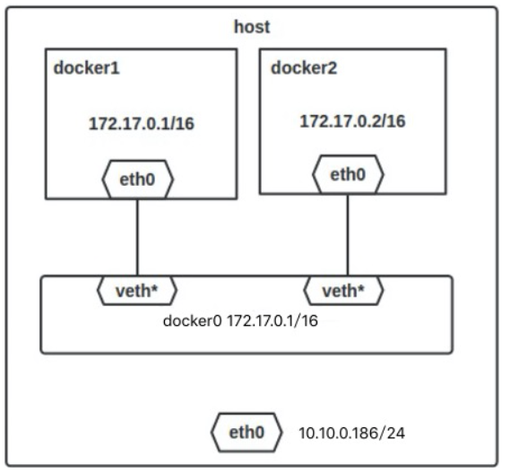
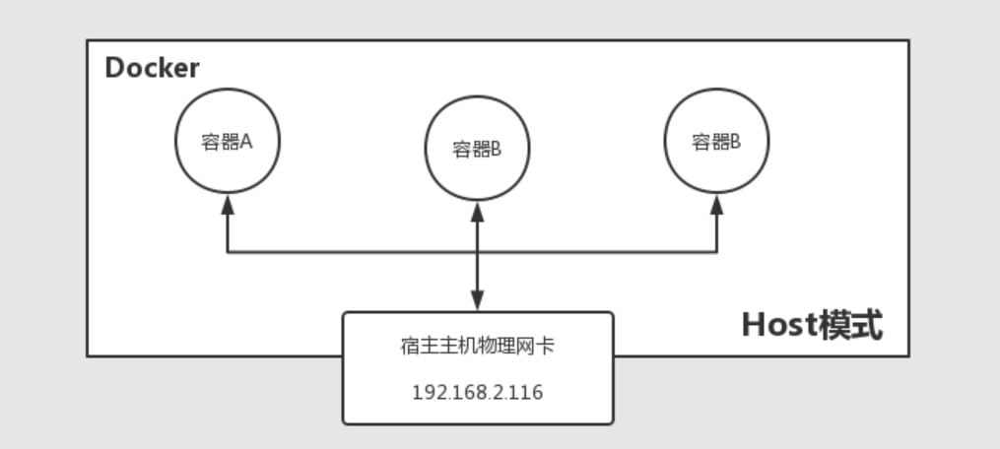
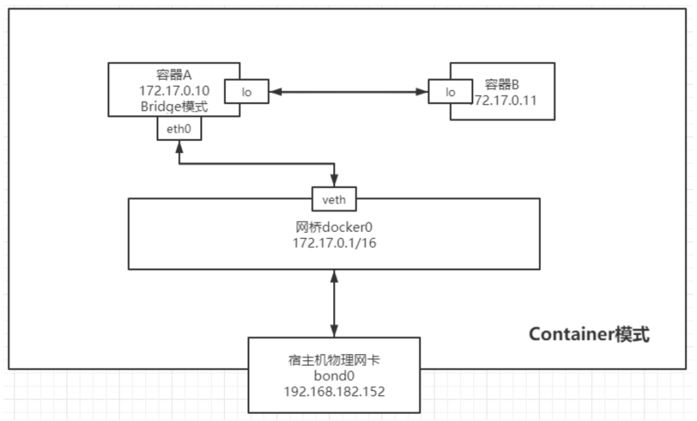

# Docker Networks

## Bridge Mode (Default)

Bridge模式会在docker服务启动时在宿主机创建一个名为docker0的虚拟网桥，通过网桥将docker容器与宿主机相连，默认docker会使用**172.17.0.0/16**这个网段，宿主机网桥分配**172.17.0.1**；docker的其他容器根据其启动顺序为其分配ip地址，通常为172.17.0.2 ... 172.17.0.3 依次分配.

若要将容器IP设为静态值，在创建时须指定`--ip [ip address]`

```shell
docker run -it --name test --network bridge --ip 172.17.0.101 centos:latest /bin/bash
```

桥接模式通过网桥连接，docker容器与宿主机同属于同一个网段，之间可以相互通信。



若想要拒绝容器间的通信，在DOCKER_OPTS 变量中设置 –icc=false，这样只有使用 –link 才能使两个容器通信.

## Host Mode

Host模式容器与宿主机共享同一张物理网卡，此时容器没有自己的独立IP地址，并且也不需要设置端口映射规则，服务启动后可直接从外部访问，此时要注意启动多个来自相同镜像的容器可能会出现端口冲突。



以host模式启动需要指定参数 `--network=host`

```shell
docker run -it --name test --network host centos:latest /bin/bash
```

## Container Mode

与Host模式类似，容器与另一个容器共享虚拟网卡，与对应容器共享同一条IP地址和端口



```shell
docker run -it --name test --network container:<container_name or container_ID> centos:latest /bin/bash
```


## 自定义网络

```shell
 docker network create --subnet=[自定义网络广播地址]/[子网掩码位数] [自定义网络名]
```

后续补充。