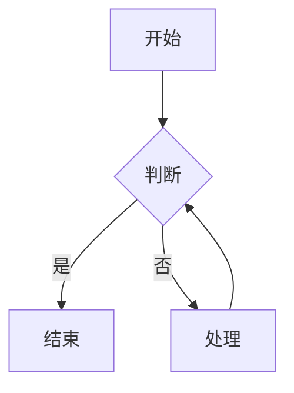
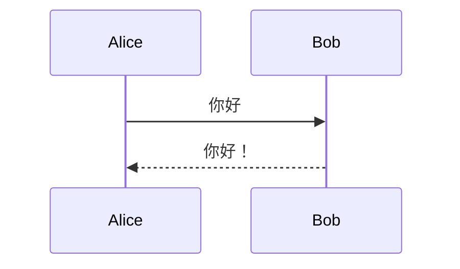
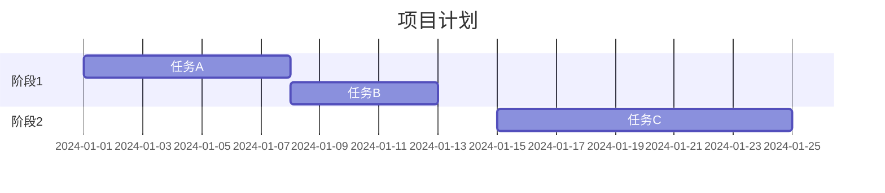
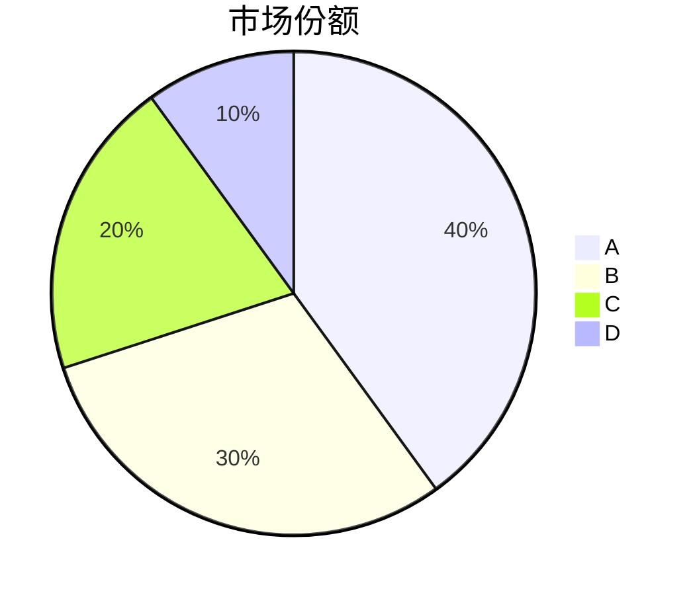
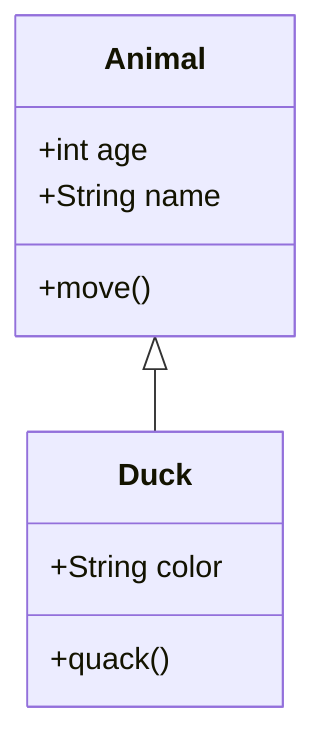
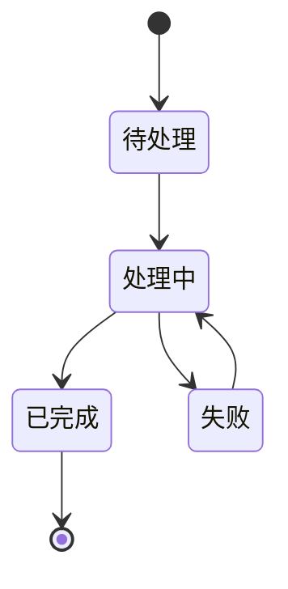
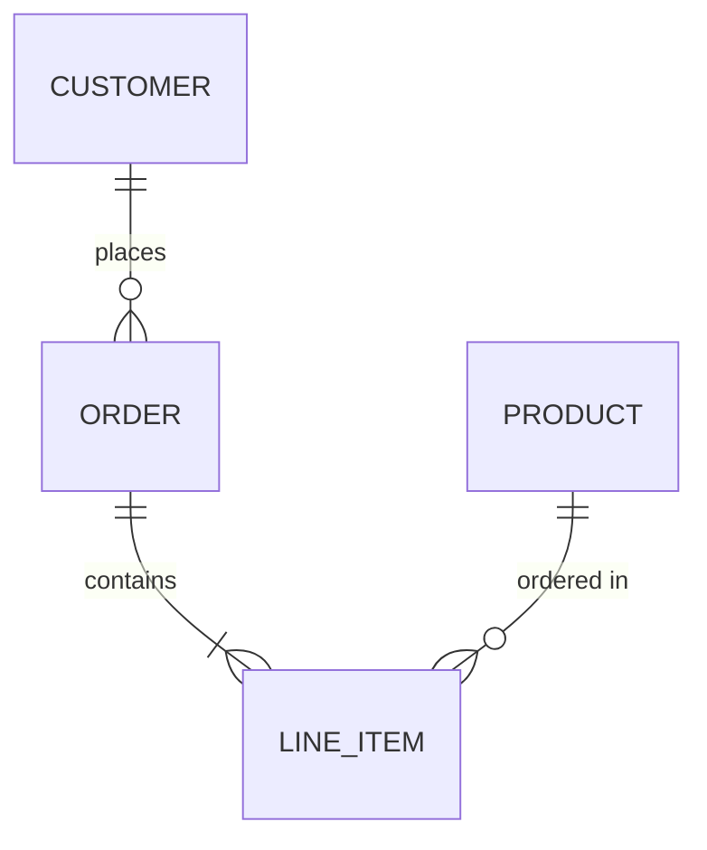
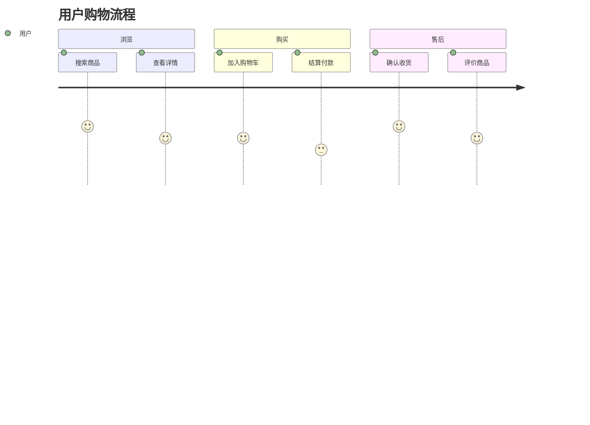
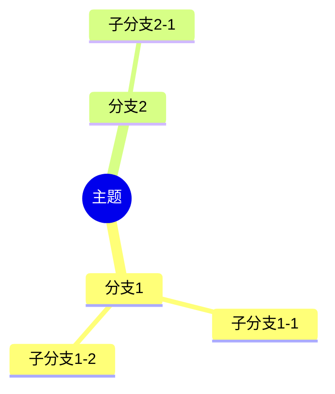

# Markdown 扩展语法

> 本文档涵盖 GFM (GitHub Flavored Markdown) 及其他常见扩展语法。

## 1. 任务列表 (Task Lists)

### 语法

```markdown
- [x] 已完成
- [ ] 未完成
- [ ] 另一个未完成
```

**渲染效果：**

- [x] 已完成
- [ ] 未完成
- [ ] 另一个未完成

### 任务列表嵌套

```markdown
- [x] 主任务
  - [x] 子任务1
  - [ ] 子任务2
- [ ] 另一个主任务
```

---

## 2. 删除线 (Strikethrough)

### 语法

```markdown
~~删除的内容~~
```

**渲染效果：** ~~删除的内容~~

---

## 3. 表格 (Tables)

详见 [03-表格语法.md](./03-表格语法.md)

### 快速示例

```markdown
| 左对齐 | 居中 | 右对齐 |
|:-------|:----:|-------:|
| A      | B    | C      |
```

---

## 4. 自动链接 (Autolinks)

### URL 自动链接

```markdown
访问 https://github.com
```

**渲染效果：** 访问 https://github.com

### 邮箱自动链接

```markdown
联系 example@email.com
```

---

## 5. 定义列表 (Definition Lists)

部分解析器支持（如 PHP Markdown Extra）：

```markdown
术语 1
: 定义 1

术语 2
: 定义 2 的第一行
: 定义 2 的第二行
```

---

## 6. 脚注 (Footnotes)

详见 [02-文本格式.md](./02-文本格式.md#4-脚注-footnotes)

```markdown
这是一个脚注[^1]。

[^1]: 脚注内容。
```

---

## 7. 缩写 (Abbreviations)

部分解析器支持：

```markdown
HTML 是超文本标记语言。

*[HTML]: HyperText Markup Language
```

鼠标悬停在 HTML 上显示完整含义。

---

## 8. 上标与下标

### HTML 方式

```markdown
H<sub>2</sub>O
E = mc<sup>2</sup>
```

**渲染效果：** H<sub>2</sub>O, E = mc<sup>2</sup>

### 扩展语法

部分编辑器支持：

```markdown
H~2~O
x^2^
```

---

## 9. 高亮标记

### 语法

```markdown
==高亮文本==
```

**渲染效果：** ==高亮文本==

> 需要 Obsidian 等编辑器支持。

---

## 10. Mermaid 图表

### 10.1 流程图

~~~markdown

~~~

**渲染效果：**


### 10.2 流程图语法

| 元素 | 语法 | 说明 |
|------|------|------|
| 矩形 | `A[文字]` | 方框节点 |
| 圆角矩形 | `A(文字)` | 圆角框 |
| 圆形 | `A((文字))` | 圆形节点 |
| 菱形 | `A{文字}` | 判断节点 |
| 六边形 | `A{{文字}}` | 六边形 |

### 连接线类型

| 语法 | 效果 |
|------|------|
| `-->` | 实线箭头 |
| `---` | 实线无箭头 |
| `-.->` | 虚线箭头 |
| `-.-` | 虚线无箭头 |
| `==>` | 粗线箭头 |
| `===` | 粗线无箭头 |
| `--文字-->` | 带文字的线 |

### 方向

| 符号 | 方向 |
|------|------|
| `TB` | 上到下 |
| `BT` | 下到上 |
| `LR` | 左到右 |
| `RL` | 右到左 |

---

## 11. 时序图 (Sequence Diagram)

~~~markdown

~~~

**渲染效果：**


### 时序图语法

| 箭头类型 | 语法 | 说明 |
|----------|------|------|
| 实线箭头 | `->>` | 同步消息 |
| 虚线箭头 | `-->>` | 返回消息 |
| 实线无箭头 | `->` | 异步消息 |
| 虚线无箭头 | `-->` | 虚线 |
| 双向箭头 | `<<->>` | 双向 |

---

## 12. 甘特图 (Gantt Chart)

~~~markdown

~~~

---

## 13. 饼图 (Pie Chart)

~~~markdown

~~~

---

## 14. 类图 (Class Diagram)

~~~markdown

~~~

---

## 15. 状态图 (State Diagram)

~~~markdown

~~~

---

## 16. 实体关系图 (ER Diagram)

~~~markdown

~~~

---

## 17. 用户旅程图 (User Journey)

~~~markdown

~~~

---

## 18. 思维导图 (Mindmap)

~~~markdown

~~~

---

## 19. 数学公式

详见 [04-数学公式.md](./04-数学公式.md)

---

## 20. 数学块

KaTeX/MathJax 渲染：

```markdown
行内公式：$E=mc^2$

块级公式：
$$
\int_0^\infty e^{-x^2} dx = \frac{\sqrt{\pi}}{2}
$$
```

---

## 21. Admonitions (提示框)

部分平台支持（如 Obsidian, MkDocs）：

```markdown
> [!NOTE]
> 这是一个注释

> [!WARNING]
> 这是一个警告

> [!TIP]
> 这是一个提示
```

### 支持的类型

| 类型 | 用途 |
|------|------|
| `NOTE` | 普通注释 |
| `TIP` | 提示建议 |
| `WARNING` | 警告 |
| `DANGER` | 危险警告 |
| `INFO` | 信息 |
| `SUCCESS` | 成功提示 |
| `FAILURE` | 失败提示 |
| `BUG` | Bug 提示 |
| `EXAMPLE` | 示例 |
| `QUOTE` | 引用 |

---

## 22. 容器 (Containers)

### MkDocs 风格

```markdown
!!! note "标题"
    这是内容
```

### VuePress 风格

```markdown
::: tip
这是一个提示
:::

::: warning
这是一个警告
:::

::: danger
这是一个危险警告
:::
```

---

## 23. 前言 (Front Matter)

YAML 格式的文档元数据：

```markdown
---
title: 文档标题
date: 2024-01-01
tags:
  - Markdown
  - 教程
categories: 技术
---

文档内容...
```

---

## 24. 短代码 (Shortcodes)

### Hugo 风格

```markdown



```

### WordPress 风格

```markdown
[gallery id="123"]
[video src="video.mp4"]
```

---

## 扩展语法兼容性

| 功能 | GFM | Obsidian | MkDocs | Hugo |
|------|:---:|:--------:|:------:|:----:|
| 任务列表 | ✅ | ✅ | ✅ | ✅ |
| 删除线 | ✅ | ✅ | ✅ | ✅ |
| 表格 | ✅ | ✅ | ✅ | ✅ |
| 数学公式 | ✅ | ✅ | ✅ | ✅ |
| Mermaid | ❌ | ✅ | ✅ | ✅ |
| 高亮 | ❌ | ✅ | ❌ | ❌ |
| 脚注 | ❌ | ✅ | ✅ | ✅ |
| Admonitions | ❌ | ✅ | ✅ | ✅ |

> GFM = GitHub Flavored Markdown
