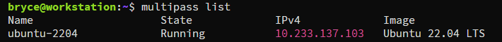
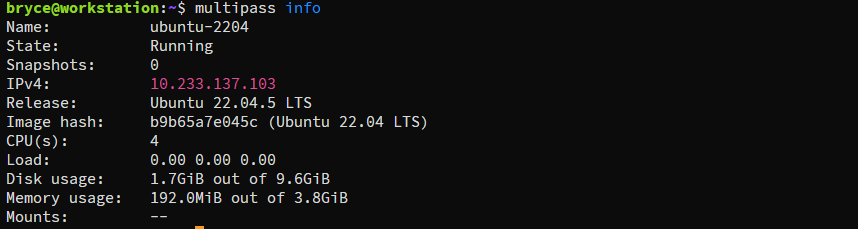

# Ubuntu 轻量级虚拟机

目前只支持ubuntu系统

## 查看可用镜像

```shell
multipass find
```

```shell
Image                       Aliases           Version          Description
core                        core16            20200818         Ubuntu Core 16
core18                                        20211124         Ubuntu Core 18
core20                                        20230119         Ubuntu Core 20
core22                                        20230717         Ubuntu Core 22
core24                                        20240603         Ubuntu Core 24
20.04                       focal             20250218.1       Ubuntu 20.04 LTS
22.04                       jammy             20250228         Ubuntu 22.04 LTS
24.04                       noble,lts         20250228         Ubuntu 24.04 LTS
24.10                       oracular          20250227         Ubuntu 24.10
daily:25.04                 plucky,devel      20250302         Ubuntu 25.04
appliance:adguard-home                        20200812         Ubuntu AdGuard Home Appliance
appliance:mosquitto                           20200812         Ubuntu Mosquitto Appliance
appliance:nextcloud                           20200812         Ubuntu Nextcloud Appliance
appliance:openhab                             20200812         Ubuntu openHAB Home Appliance
appliance:plexmediaserver                     20200812         Ubuntu Plex Media Server Appliance

Blueprint                   Aliases           Version          Description
anbox-cloud-appliance                         latest           Anbox Cloud Appliance
charm-dev                                     latest           A development and testing environment for charmers
docker                                        0.4              A Docker environment with Portainer and related tools
jellyfin                                      latest           Jellyfin is a Free Software Media System that puts you in control of managing and streaming your media.
minikube                                      latest           minikube is local Kubernetes
ros2-humble                                   0.1              A development and testing environment for ROS 2 Humble.
ros2-jazzy                                    0.1              A development and testing environment for ROS 2 Jazzy.
```


## 实例创建启动操作

### 创建实例

```shell
mutilpass launch
```

默认创建使用最新的LTS版本，配置1 CPU，1G RAM，5G disk（默认CPU数量1，内存1G，磁盘 5G）

### 创建自定义实例

```shell
 # multipass launch [<镜像>] [--name|-n <实例名>] [--cpus|-c <核心数量>] [--disk|-d <磁盘>] [--memory|-m <内存>] [--timeout <超时(秒)>]
 multipass launch 22.04 -n master -c 4 -d 10G -m 4G
 
# -n | --name：实例名称，primary为主实例名称，不指定，则随机生成名称
# -c | --cpus：分配实例CPU数量，最小值：1，默认值：1
# -d | --disk：分配实例磁盘空间，最小值：512M，默认值：5G，单位可选K M G
# -m | --memory：分配实例内存量，最小值：128M，默认值：1G，单位可选K M G
# --timeout：超时时间，单位为秒，超时报错，默认为300秒
```

### 查看实例

列出所有实例

```shell
multipass list
```



查看实例信息

```shell
multipass info
```



### 启动实例

```shell
# 默认启动primary实例
multipass start 
# 启动所有实例
multipass start --all
# 启动多个实例 支持指定多个同时启动
multipass start <实例>[<实例>...]
```

### 重启实例

```shell
# 默认重启primary实例
multipass restart 
# 重启所有实例
multipass restart --all
# 重启多个实例 支持指定多个同时重启
multipass restart <实例>[<实例>...]
```

### 停止实例

```shell
# 默认停止primary实例
multipass stop 
# 停止所有实例
multipass stop --all
# 停止多个实例 支持指定多个同时停止
multipass stop <实例>[<实例>...]
```

### 挂起实例

```shell
# 默认挂起primary实例
multipass suspend
# 挂起所有实例
multipass suspend --all
# 挂起多个实例 支持指定多个同时挂起
multipass suspend <实例>[<实例>...]
```

## 实例删除操作

### 标记删除

不是永久删除，相当于移动到回收站

```shell
# 标记删除所有实例
multipass delete --all
# 标记删除指定实例 支持多个
multipass delete <实例>[<实例>...]
```

### 永久删除

永久删除被标记删除的实例	

```shell
 multipass purge
```

## 还原实例

只能恢复被标记删除的实例，永久删除的实例不能恢复

```shell
# 还原所有被标记的实例
multipass recover --all
# 还原指定的实例
multipass recover <实例>[<实例>...]
```

