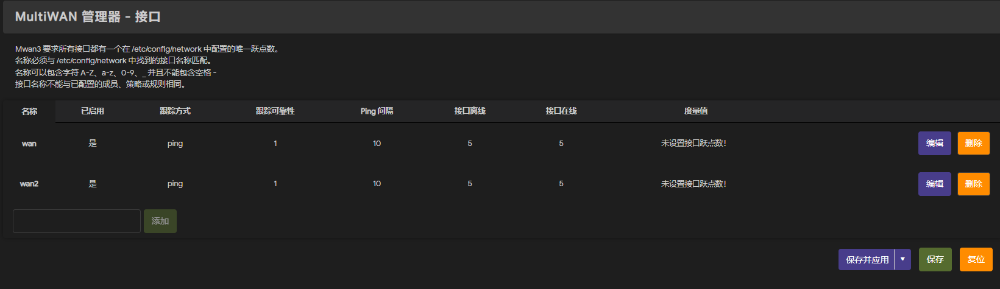
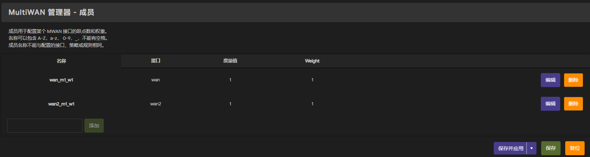
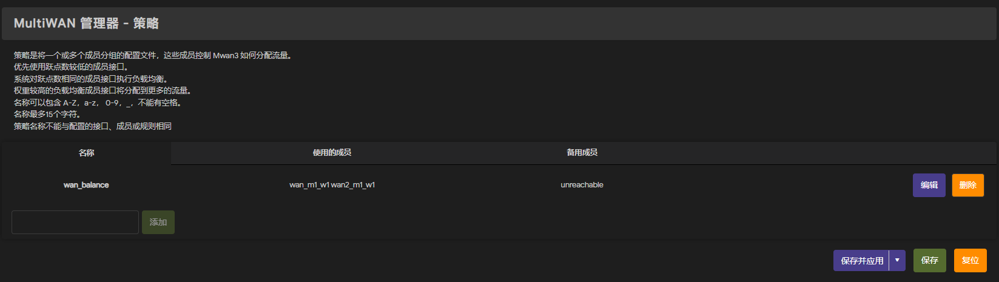
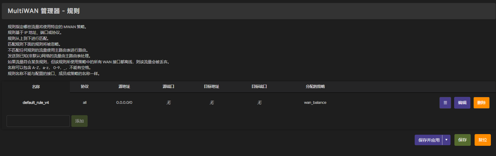

### 接口选项卡

添加wan口，状态设置为启用，名称随意，有几个wan口就添加几条记录

### 成员选项卡
添加成员，分配wan口，根据带宽设置，度量值与权重可用默认，有几个wan口就添加几个成员

### 策略选项卡
添加策略，根据需求分配策略，可叠加多个wan口或只选择某个wan口

### 规则选项卡
分配策略，设置源地址为0.0.0.0/0（或根据具体需求），分配具体的策略

设置完成后重启生效！！！

