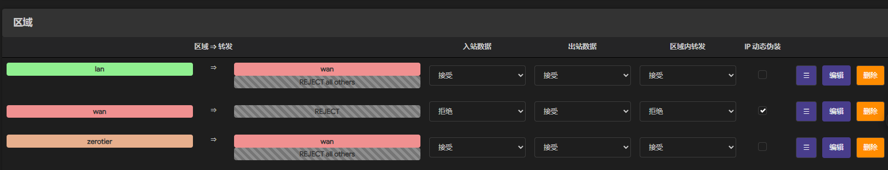

# OpenWRT

>  问题： 每次重启系统后，zerotier配置信息默认保存在/var/lib中，会丢失配置信息，导致接口变化

### 解决方案

在终端中配置openwrt，放弃web端可视化界面

```shell
# 1.安装后不启动，修改/etc/config/zerotier配置文件

config zerotier 'global'
        option enabled '1'	# 设置服务状态为可用
        option config_path '/etc/zerotier'	# !!! 修改配置保存位置，从/var中迁出
```

```shell
# 2.启动服务
service zerotier start

# 3.查看网络信息
zerotier-cli listnetworks

# 4.加入moon节点，更改配置保存位置后该配置重启不会丢失
zerotier-cli orbit <moon_id> <moon_id> 

# 5.查看节点信息，应看到moon节点
zerotier-cli listpeers
```

### 防火墙配置

入站 出站 区域内转发均为接受，允许转发到wan



### 接口配置

- 设置为静态地址，ip地址填写zerotier分配的地址，注意广播地址不要写错
- DHCP服务要关闭，不然会跟lan口冲突！


### 路由配置

需要在zerotier中添加路由表，使路由器下设备能够被访问