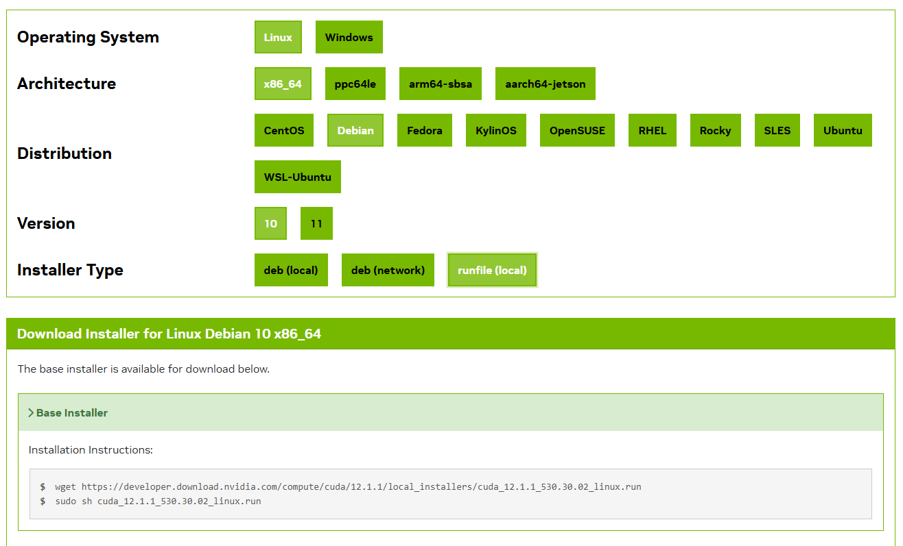
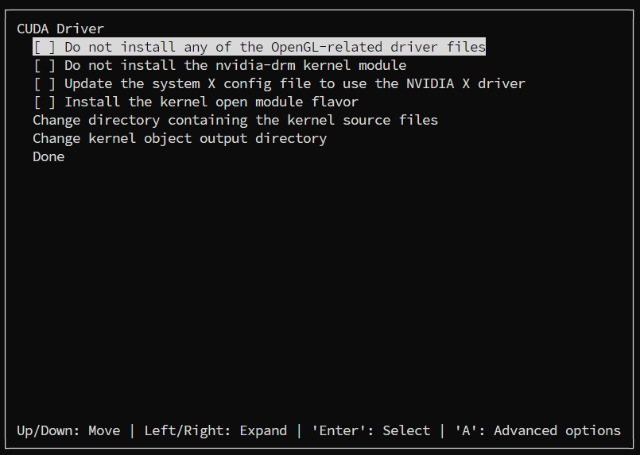
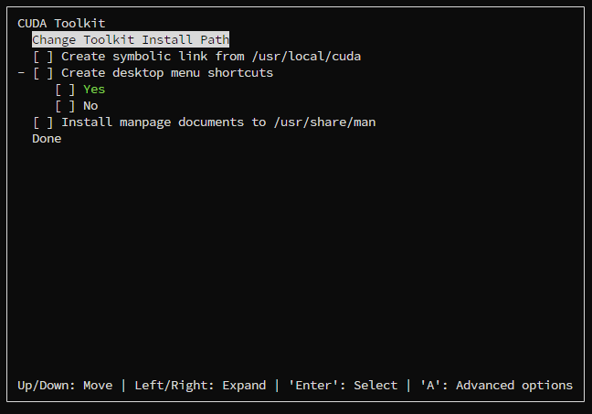
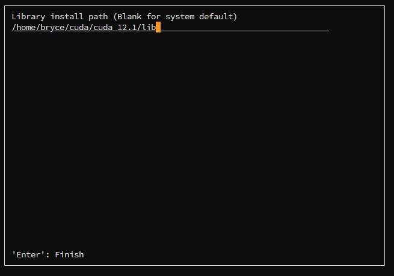
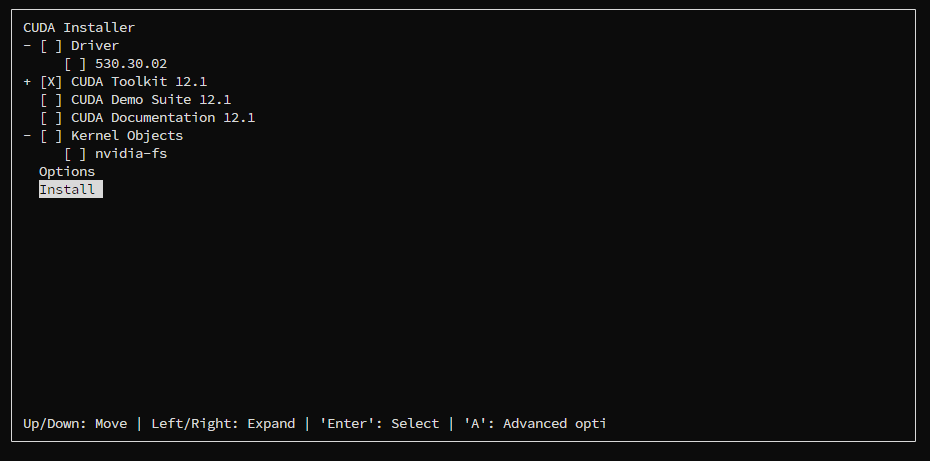

# CUDA Install

Linux Service 无sodo权限安装特定版本CUDA

### 1.Download 

下载特定版本[cuda toolkit](https://developer.nvidia.com/cuda-toolkit-archive)

```shell
wget https://developer.download.nvidia.com/compute/cuda/12.1.1/local_installers/cuda_12.1.1_530.30.02_linux.run
chmod +x cuda_12.1.1_530.30.02_linux.run
# 无sudo运行脚本
./cuda_12.1.1_530.30.02_linux.run
```



### 2.Install

进入脚本，同意用户协议

安装选项除了cuda toolkit全部取消

#### cuda driver



进入option，取消勾选全部

#### cuda toolkit

全部取消勾选，并**更改安装路径**到有写入权限的位置！



#### Library install path

写入到刚刚设置路径的lib目录下



设置完成后选择安装



### 3.CUDA_HOME set

配置环境变量，在.bashrc中添加PATH和LD_LIBRARY_PATH

```shell
# .bashrc

# # CUDA_HOME
export CUDA_HOME=/home/yufengming/cuda/cuda-12.1
export PATH=$PATH:$CUDA_HOME/bin
export LD_LIBRARY_PATH=$LD_LIBRARY_PATH:$CUDA_HOME/lib64
```

